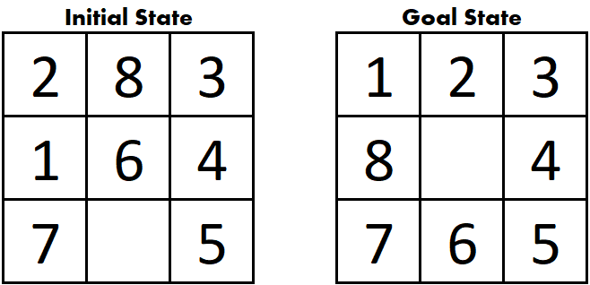

# 8-Puzzle Solver

This project is part of the course AT70.02 Data Structures and Algorithm
August 2022 Semester at AIT.

## Introduction

8-puzzle consists of 8 tiles in a 3 x 3 grid. This means it has one empty space where the tile can be moved to.

The goal of this 8-puzzle is to make initial state becomes goal state by swapping empty space with any adjacent tiles one by one until it reaches goal state. From the initial state below, we can choose to swap either 5 or 6 or 7 with empty space. 

## Example

## Rules
1. The empty space can be moved in four direction: Up, Down, Left of Right.
2. The empty space can move only 1 step at a time.

## Algorithms
There are 4 algorithms used in this project.
### A* 
There are 2 different heuristic functions used.
- Counting misplaced tiles. There are 4 misplaced tiles in the example.
- Manhattan distance. The total distance of all tiles trying to reach goal position. For example, tile no.8 needs 2 steps to reach goal position. Hence, the total distance of all tiles is 1 + 1 + 0 + 0 + 0 + 1 + 0 + 2 = 5. Tile no.3,4,5,7 has value 0 because they are in the correct position.
### Dijkstra
Similar to A*, but heuristic function is 0.
### BFS
### DFS

