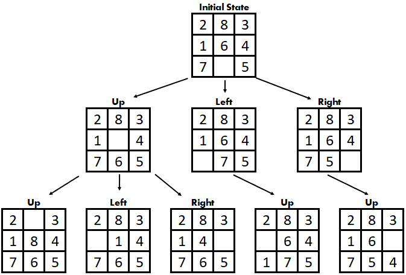
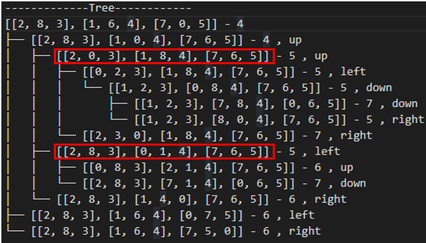
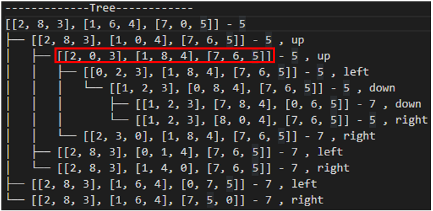

# 8-Puzzle Solver

This project is part of the course AT70.02 Data Structures and Algorithm
August 2022 Semester at Asian Institute of Technology.

----------

## Introduction

8-puzzle consists of 8 tiles in a 3 x 3 board. This means it has one empty space where the tile can be moved to.

The goal of this 8-puzzle is to make initial state becomes goal state by swapping empty space with any adjacent tiles one by one until it reaches goal state. From the initial state below, we can choose to swap either 5 or 6 or 7 with empty space. 

There are $9!$ or 362,880  possible configuration in the 3 x 3 board. For any given goal state, there are only $9!/2$ initial states that can reach the goal state.

----------

## Example

----------

## Rules
1. The empty space can be moved in four direction: Up, Down, Left of Right.
2. The empty space can move only 1 step at a time.

----------

## Implemenation

First, we need to check if the puzzle is solvable or not. The inversion method is used to check this.

> It is not possible to solve an instance of 8 puzzle if number of inversions is odd in the input state.

> A pair of tiles form an inversion if the values on tiles are in reverse order of their appearance in goal state.

[How to check if an instance of 8 puzzle is solvable?](geeksforgeeks.org/check-instance-8-puzzle-solvable/#:~:text=Following%20is%20simple%20rule%20to,has%2011%20inversions%2C%20therefore%20unsolvable.)

To solve this 8-puzzle, the idea is to find all of the children wihch is the possible states of current state, and then choose the child as current state. This process continues until child node that is the same as goal state is found. 

To generate children nodes, empty space is moved up, down, left or rigth to find next possible states.

Then, append these children in **a data structure depends on the algorithm**. Then, select one child from this list and check if it is a goal state or not. If not, new set of children are generated out of this child and appened to the same list.The child selected is then stored in a list called `visited`, this list is used to check whether generated children are already visited or not. If visited, these generated children are not appended to the list.

To solving this puzzle we can visit all the children one by one until we find the goal. Or, we can find the most **promising child** that can lead us to goal and then continue in that direction.

But how can we know which one is the **best move**?
In this project, 4 algorithms have been used to solve this issue.

----------

## Algorithms

3 uninformed search (BFS, DFS, Dijkstra) and 1 informed (A*) are used.

### BFS (Breadth first search)

BFS visits all the children of the current state in the same level in the tree. Then it moves to next level or grandchildren.
The generated children are put in `Queue()` in python which is a FIFO queue. So, the first state appended is visited first.

### DFS (Depth First Search)
DFS visits the child of child all the way down. All generated children are put in `LifoQueue()` in python which is LIFO queue.

### Dijkstra
Similar to A*, but heuristic function is 0. Same code is used, but the priority is changed to $f(x) = g(x)$. In this case it can be considered as BFS because the priority is the level in the tree and it will visit each children level by level.

### A* (A star)

Instead of selecting a child without direction, Cost function $f(x)$ is used to approximate the cost to reach goal state. The child with lowest cost is then selected and expanded.

$f(x)=g(x)+h(x)$ ;where $x$ is the current node.

$g(x)=$ actual cost of path from initial node to node $x$ or level in tree.

$h(x)=$ heuristic function which estimates the cost of node $x$ to goal node.

$f(x)=$ actual distance so far + estimated distance remaining

After getting the cost function, the generated children are appended to `heapdict()` in python which is a priority queue. The priority is our cost function.

Two heuristic funtions are used in this project. 
#### Counting misplaced tiles
This method counts the number of misplaced tiles in current state compared to goal state. There are 4 misplaced tiles in initial state in the example. The number behind the list is our $f(x)$. 

At the second expansion there are two children with the same cost, `heapdict()` pops out object that has same priority in LIFO order. So the left node is expanded first, and children with cost 6 and 7 are appended. Now we have only one child with cost 5, and it gets expanded.

In order to improve this algorithm, we have to find a better heuristic function.

#### Manhattan distance
This method calculate the total distance of all tiles trying to reach goal position. For example, tile no.8 needs 2 steps to reach goal position. Hence, the total distance of all tiles is 1 + 1 + 0 + 0 + 0 + 1 + 0 + 2 = 5. Tile no.3, 4, 5, and 7 has value 0 because they are already in the correct position.

Now at second expansion, there is only one child with cost 5. Thus, we can reduce the number of expansion (time) and number of generated children (memory). 

----------

## Summary

- A* algorithm gives the best optimal solution out of the 4 algorithms used in this project.
- Manhattan distance is better than counting misplaced tiles.
- BFS and Dijkstra are ok.
- DFS is worst.

----------

## Possilbe future work & limitation
- Try 15-puzzle which is more complicated.
- Try IDA* (IterativeDeepening A*) algorithm [Complete Solution of the Eight-Puzzle
and the Benefit of Node Ordering in IDA *](https://www.ijcai.org/Proceedings/93-1/Papers/035.pdf)
- Cannot plot the tree for DFS because of maximum recursion depth exceeded.
----------

## References

[Heuristic search](http://science.slc.edu/~jmarshall/courses/2005/fall/cs151/lectures/heuristic-search/)

[Solving 8 puzzle using a* algorithm](https://blog.goodaudience.com/solving-8-puzzle-using-a-algorithm-7b509c331288)

[eight-puzzle-solver](https://github.com/Elzawawy/eight-puzzle-solver)